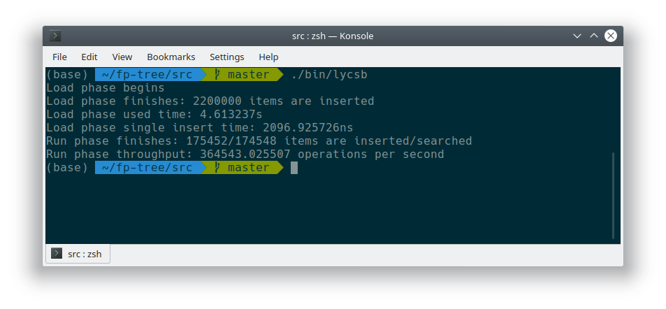

# FPTree

Sun Yat-sen University DBMS 2019 Course Project. A KV-based database optimized for NVM.

Group Members:

- Huang Yuhui ([@huanghongxun](https://github.com/huanghongxun))
- Chen Tailin ([@ctlchild](https://github.com/ctlchild))
- Liang Saibo ([@dasinlsb](https://github.com/dasinlsb))
- Liu Haohua ([@howardlau1999](https://github.com/howardlau1999))
- Gu Yuran ([@gyr5](https://github.com/gyr5))

## Getting Source Code

```bash
git clone https://github.com/sysu-2019-dbms/fp-tree.git
cd fp-tree
git submodule update --init --recursive
```

## Building & Running

### Setup NVM Simulation Environment

Firstly make sure your system meets the requirement of running Ubuntu 18.04 (or higher) and follow the instructions in [Prerequisite](PREREQUISITE.md) section to set up an environment for NVM simulation.

### Benchmark

The default DB storage paths are:

- LevelDB: `/pmem-fs/leveldb`
- FPTree: `/pmem-fs/fptree`

Build executables by running:

```bash
cd src && make
```

The executables will be placed in `src/bin` folder.

Or you can specify the path during compilation by setting variables:

```bash
cd src && make LEVEL_DB_PATH=/path/to/leveldb FPTREE_DB_PATH=/path/to/fptree
```

*Note: For FPTree you must create the directory manually or you will get runtime error.*

Run YCSB on LevelDB:

```bash
./bin/lycsb
```

Run YCSB on both LevelDB and FPTree:

```bash
./bin/ycsb
```

### Running Test

```shell
cd test && make all
./bin/utility_test
./bin/fptree_test
```

You can also specify FPTree storage path by setting `FPTREE_DB_PATH` variable during compilation.

The command `make all` will build googletest library into directory `test`. You can try `make ./bin/utility_test` and `make ./bin/fptree_test` if you have global googletest installed.

## Test Result

Host Machine:

- CPU: Intel i7-8700K @ 3.70 GHz
- RAM: DDR4 2666 MHz 32 GB
- HDD: 2 TB 7200 RPM
- Host OS: Windows 10

Virtual Machine:

- Guest OS: `Kubuntu 18.10 Linux ubuntu 4.18.0-18-generic #19-Ubuntu SMP Tue Apr 2 18:13:16 UTC 2019 x86_64 x86_64 x86_64 GNU/Linux`
- RAM: 8GB
- CPU: 4 cores

### LYCSB



### YCSB


### Google Test

#### Utility Test


#### FPTree Test

