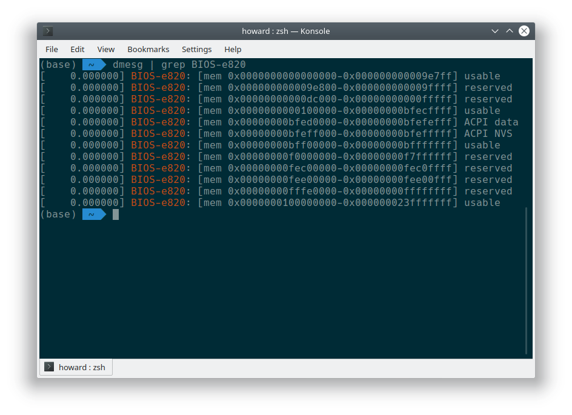
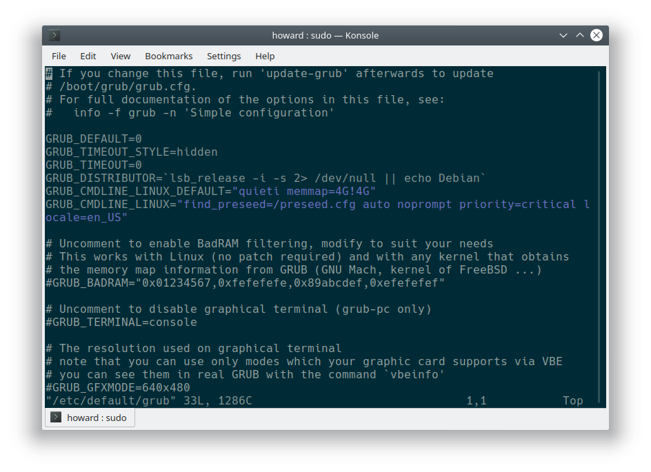
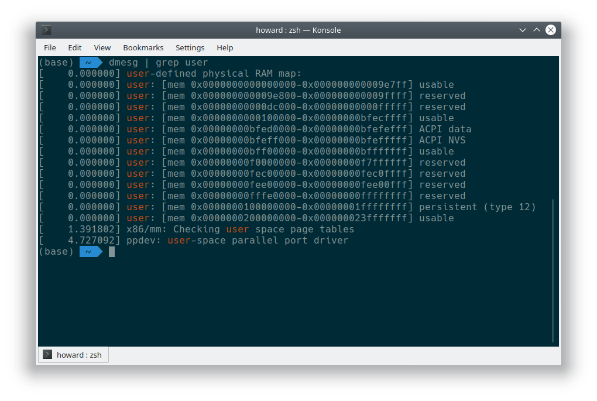
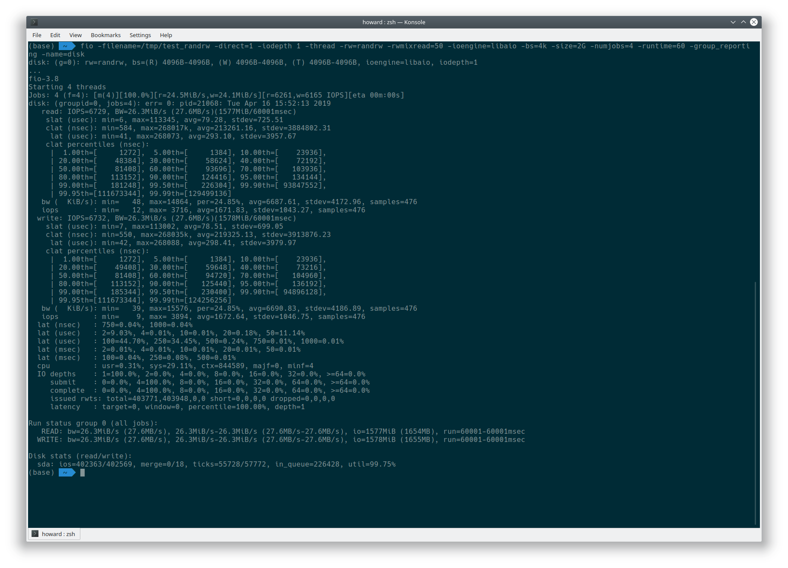
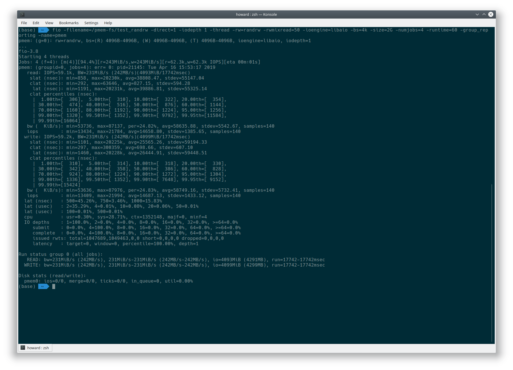
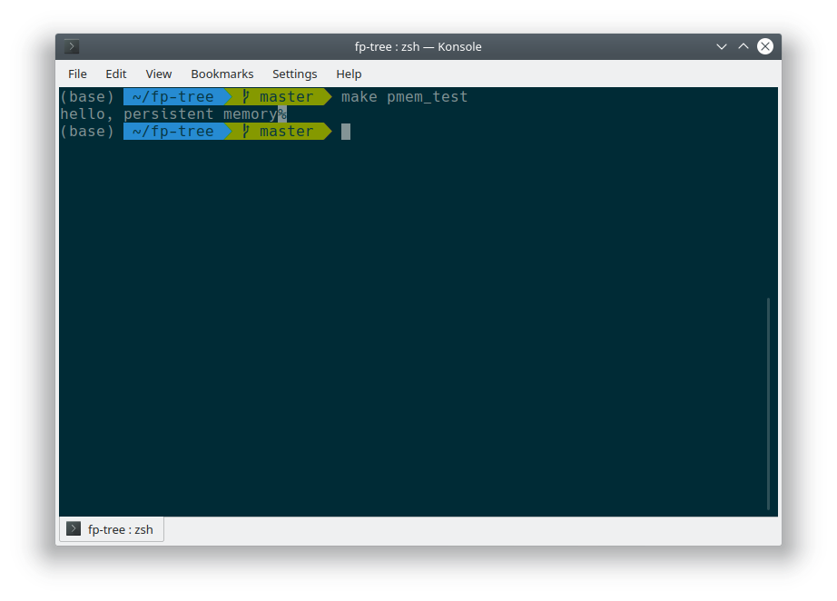

# 论文阅读与前期工作总结

 姓名 |学号
-----|----
刘皓铧|17343075
黄昱珲|17343050
梁赛波|17343069
辜宇然|17343031
陈泰霖|17343012

## 前期工作

1. 使用示意图展示普通文件 IO 方式 (`fwrite` 等) 的流程，即进程与系统内核，磁盘之间的数据交换如何进行？为什么写入完成后要调用 `fsync`？
    
    `fwrite` 是标准库调用，调用后会将进程内容复制到 `stdio` 缓冲区中，在 `fflush` 调用后，标准库才调用 `write` 等系统调用。`write` 等系统调用会将内容复制到内核缓冲区中，也并没有真正写入磁盘上。只有调用 `fsync` 之后，内核才会将缓冲区中的内容真正地写入到磁盘里。如果不调用 `fsync`，有可能导致数据丢失的问题。

    综上所述，标准库 I/O 存在两个缓冲区，进程首先与标准库缓冲区交互，标准库缓冲区再与内核缓冲区交互，然后才是内核缓冲区与磁盘之间的交互。

2. 简述文件映射的方式如何操作文件。与普通 IO 区别？为什么写入完成后要调用 `msync`？文件内容什么时候被载入内存？(使用什么函数，函数的工作流程)

    首先调用 `mmap` 将内存空间映射到文件上，之后对返回的指针可以像普通内存一样操作，使用完毕后调用 `munmap` 取消映射并将内存中的内容写入到文件里。中途可以随时调用 `msync` 同步内存和文件。

    常规文件操作需要从磁盘到页缓存再到用户主存的两次数据拷贝。而 `mmap` 操控文件，只需要从磁盘到用户主存的一次数据拷贝过程。说白了，`mmap` 的关键点是实现了用户空间和内核空间的数据直接交互而省去了空间不同数据不通的繁琐过程。因此 `mmap` 效率更高。

    由于对映射空间所做的修改只存在于内存中，如果不调用 `msync` 的话文件不会反映所做的修改。

    文件内容只有在发生缺页异常的时候才会被载入到内存。

3. 参考 Intel 的 NVM 模拟教程模拟 NVM 环境，用 `fio` 等工具测试模拟 NVM 的性能并与磁盘对比（关键步骤结果截图）。

    首先查看本机的内存情况：

    ```bash
    dmesg | grep BIOS-e820
    ```

    

    可以看到这台机子的 4G 大约 8G 的内存是可用的，我们将它作为 NVM 模拟区域使用。

    编辑 `/etc/default/grub`，修改以下内容：

    ```bash
    GRUB_CMDLINE_LINUX_DEFAULT="quiet memmap=4G!4G"
    ```

    这个选项说明将内存 4G 开始的 4G 大小的内存，也就是 4G~8G 空间映射为非易失性内存。

    

    重启使其生效：

    ```bash
    sudo update-grub
    sudo reboot
    ```

    重启后查看映射是否成功：

    ```bash
    dmesg | grep user
    ```

    

    可以看到 4G~8G 已经映射成了 NVM。最后对其格式化，然后挂载到一个目录中使其能够进行读写：

    ```bash
    sudo fdisk -l /dev/pmem0
    sudo mkfs.ext4 /dev/pmem0
    sudo mkdir /pmem-fs
    sudo chown `whoami` /pmem-fs
    sudo mount -o dax /dev/pmem0 /pmem-fs
    ```

    `fio` 磁盘测试结果：
    
    `fio` NVM 测试结果：
    

    可以看出 NVM 比磁盘读写快了一个数量级。

4. 使用 PMDK 的 `libpmem` 库编写样例程序操作模拟 NVM（关键实验结果截图，附上编译命令和简单样例程序）。

    直接从软件源安装 `libpmem` 库即可：

    ```bash
    sudo apt install libpmem1 libpmem-dev
    ```

    下面是示例程序。这个程序将一个字符串写到非易失性内存中，然后执行后执行 `cat /pmem-fs/myfile` 可以看到写入的字符串。

    ```c
    #include <sys/types.h>
    #include <sys/stat.h>
    #include <fcntl.h>
    #include <stdio.h>
    #include <errno.h>
    #include <stdlib.h>
    #include <unistd.h>
    #include <string.h>
    #include <libpmem.h>
    
    /* using 4k of pmem for this example */
    #define PMEM_LEN 4096
    
    #define PATH "/pmem-fs/myfile"
    
    int
    main(int argc, char *argv[])
    {
        char *pmemaddr;
        size_t mapped_len;
        int is_pmem;
    
        /* create a pmem file and memory map it */
        if ((pmemaddr = pmem_map_file(PATH, PMEM_LEN, PMEM_FILE_CREATE,
                    0666, &mapped_len, &is_pmem)) == NULL) {
            perror("pmem_map_file");
            exit(1);
        }
    
        /* store a string to the persistent memory */
        strcpy(pmemaddr, "hello, persistent memory");
    
        /* flush above strcpy to persistence */
        if (is_pmem)
            pmem_persist(pmemaddr, mapped_len);
        else
            pmem_msync(pmemaddr, mapped_len);
    
        /*
        * Delete the mappings. The region is also
        * automatically unmapped when the process is
        * terminated.
        */
        pmem_unmap(pmemaddr, mapped_len);
    }
    ```

    程序使用以下命令编译执行：

    ```bash
    gcc src/pmem_example.c -lpmem -o pmem_example
    ./pmem_example
    cat /pmem-fs/myfile
    ```

    

## 论文阅读

1. 总结一下本文的主要贡献和观点 (500字以内) (不能翻译摘要)。（回答本文工作的动机背景是什么，做了什么，有什么技术原理，解决了什么问题，其意义是什么）

    近年来新兴的存储技术 SCM，有着传统存储器的非易失性，又有传统内存的低延迟和按字节访问的特性。理论上可以在持久化存储数据结构的同时获得接近 DRAM 的访问性能。目前常用的传统 `B-Tree` 不能满足一致性要求，同时 SCM 具有比 DRAM 更慢的延迟以及读写不对称的问题，SCM 的写入速度远远慢于读取速度，因此，一些关于 `B-Tree` 的假设很可能不能满足。目前在 SCM 上实现的一些数据结构不仅性能上不如传统的 `B-Tree`，同时也没能全部解决在 SCM 上可能遇到的问题。所以本文提出了一种新的持久化的 `B-Tree` 来更好地利用 SCM 的特性，解决了数据一致性、数据恢复、部分写入、内存泄漏的问题，同时性能上与传统的 `B-Tree` 相似。

    本文基于四项基本原则提出了 `FP Tree` 数据结构及其基本操作：

    1. 指纹化
    2. 选择性持久化
    3. 选择性并发性
    4. 可靠的编程模型

    文章的意义在于解决了前人都没能很好的解决的问题，同时获得了比前人更好的性能，接近了传统的 `B-Tree`，为 SCM 提出了更好的数据库索引数据结构，同时也利用上了 DRAM，提供更好的性能。

2. SCM 硬件有什么特性？与普通磁盘有什么区别？普通数据库以页的粒度读写磁盘的方式适合操作 SCM 吗？

    SCM 硬件有着传统存储器的非易失性，又有传统内存的低延迟和按字节访问的特性，同时读写不对称，写要远远慢于读。与普通磁盘最大的区别就在于读写的粒度不同，SCM 可以按字节读写，也可以按页读写。普通数据库按页读写的操作也能应用在 SCM 上，但是不能发挥其最大效用。

3. 操作 SCM 为什么要调用 `CLFLUSH` 等指令？

    操作 SCM 的时候数据并不是马上写入到 SCM 中，而是先写入到 CPU 的 Cache 中，如果不调用 `CLFLUSH`，不能保证数据能写入到 SCM 中。只有调用 `CLFLUSH` 才能确保刚刚操作的数据被写入到 SCM 里。

4. FPTree 的指纹技术有什么重要作用？

    指纹技术使得关键字存在时，叶子节点内的关键字搜索次数平均情况下只需要**一次**，使得性能极大提升。

5. 为了保证指纹技术的数学证明成立，哈希函数应如何选取？（哈希函数生成的哈希值具有什么特征，能简单对键值取模生成吗？）

    哈希函数生成的哈希值必须是 8 位的，也就是只能有 256 种取值（0~255），而且需要服从均匀分布。如果键值均匀分布，可以取模生成。

6. 持久化指针的作用是什么？与课上学到的什么类似？

    用来提供数据恢复功能，每次程序重启后，持久化指针会用来刷新易失性指针。跟课上学到的 Record ID 类似。
