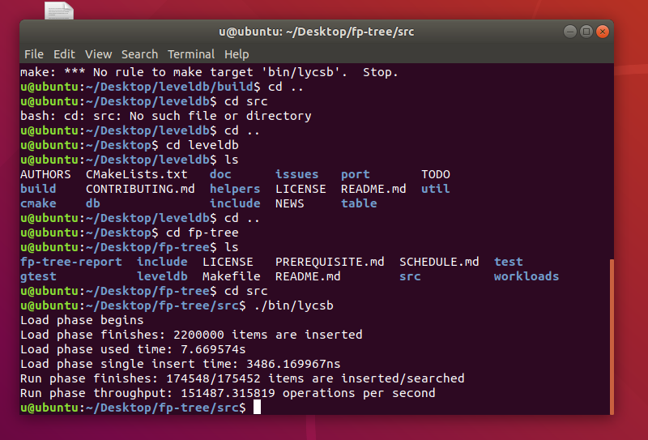
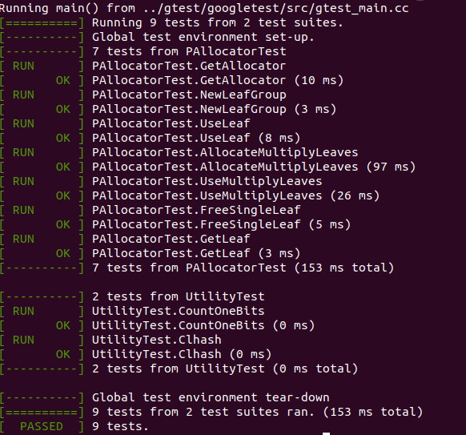

# 系统说明书

Sun Yat-sen University DBMS 2019 Course Project.

 姓名 |学号
-----|----
刘皓铧|17343075
黄昱珲|17343050
梁赛波|17343069
辜宇然|17343031
陈泰霖|17343012

Group Members:

- Huang Yuhui ([@huanghongxun](https://github.com/huanghongxun))
- Chen Tailin ([@ctlchild](https://github.com/ctlchild))
- Liang Saibo ([@dasinlsb](https://github.com/dasinlsb))
- Liu Haohua ([@howardlau1999](https://github.com/howardlau1999))
- Gu Yuran ([@gyr5](https://github.com/gyr5))

## Building & Running

Firstly make sure your system meets the requirement of running Ubuntu 18.04 (or higher) and follow the instructions in [Prerequisite](PREREQUISITE.md) section to set up an environment for NVM simulation.

---

## 项目内容

>实验项目完成的目标是完成基于针对NVM优化的数据结构FPTree，实现一个简单的键值存储引擎FPTreeDB。我们通过将其包装成一个调用库，供用户程序使用并管理其数据存储，与LevelDB的使用方式类似。
其对外可用的对数据的基本操作就增删改查：
>
>1. Insert增
>
>2. Remove删
>
>3. Update改
>
>4. Find查
>
>5. 系统恢复（采用课本介绍的bulkloading）
>
>PS: 只需根据代码中留下的注释TODO和下面说明进行填充实现，通过简单的单元测试就可以完成。本次实现的是FPTree的单线程版本，不需要做FPTree的日志机制，走通操作流程就行。
>需要做的：
>
>+ 单线程版本的FPTree
>+ NVM相关编程
>
---

## 项目构成（逐次依据版本修改）

+ v1
    1. 系统说明书
        + 描述系统功能
        + 完成部分如何使用/编译
    
    2. PAllocator实现并通过utility测试
        + 关于`PAllocator`：`PAllocator`是负责初始化申请空间的`class`，其中包括申请用于NVM的空间，建立硬盘和NVM间映射和数据写回。
    
        + 在课程设计的`PAllocator`定义如下：
        >&emsp;&emsp;这是NVM文件管理的主要对象，其负责分配LeafNode在NVM中的空间，映射数据文件并返回虚拟地址给LeafNode使用。其管理的叶子文件的粒度是一个LeafGroup，一个LeafGroup由多个叶子以及一个数据头组成，数据头由一个8字节的当前LeafGroup使用叶子数和叶子槽的bitmap，bitmap为了简单使用1个byte指明一个槽位。
        >
        >具体参考：https://github.com/ZhangJiaQiao/2019-DBMS-Project/blob/master/Programming-FPTree/README.md
        >

        + 其中本实验需要补全的操作
            + 关于Leaf的操作：关于Leaf之前已有介绍，实际上Leaf就是存储很多键值对的数据结构，其中的键值对顺序存储。

    3. utility测试：

        + 关于utility测试：使用Google test进行测试

            ```shell
            cd test && make all
            ./bin/utility_test
            ./bin/fptree_test
            ```
    

    4. LevelDB的使用以及测试，对应`lycsb.cpp`，`p_allocator.cpp`的实现和运行，`utility_test.cpp`的运行

        + 关于lycsb.cpp：其功能包括导入数据，测试数据库leveldb性能

        + 补全部分包括：
            
            1. 打开并初始化leveldb数据库
            2. 从文件读入数据
            3. 向数据库中插入数据/查询数据
            4. 计算数据库效率

        + 测试方法：

            ```shell
            cd src && make LEVELDB_DB_PATH=/path/to/leveldb ./bin/lycsb
            ./bin/lycsb
            ```
    
---

## 计划时间

按照TA给定的时间依序完成

>系统说明书，PAllocator实现并通过utility测试，LevelDB的使用以及测试，对应lycsb.cpp，p_allocator.cpp的实现和运行，utility_test.cpp的运行 --- 5/4晚前发布v1版本branch(不会分支的自学)(20分)
>
>FPTreeDB插入和重载操作并通过相关测试，对应fptree.cpp的实现和fptree_test.cpp部分的运行 --- 5/11晚前发布v2版本branch(30分)
>
>FPTreeDB查询和更新操作并通过相关测试，对应fptree.cpp的实现和fptree_test.cpp部分的运行 --- 5/18晚前发布v3版本branch(10分)
>
>FPTreeDB删除操作和所有剩下实现以及测试，对应fptree.cpp的实现和fptree_test.cpp所有的运行 --- 5/31晚前发布final版本branch，作为最后发布版本(40分)
>
>具体参考：https://github.com/ZhangJiaQiao/2019-DBMS-Project/blob/master/Programming-FPTree/README.md
>
---

## 测试结果

+ v1

1. ycsb测试



2. google test

